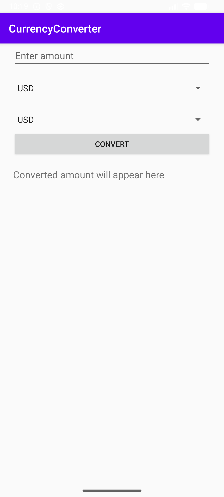
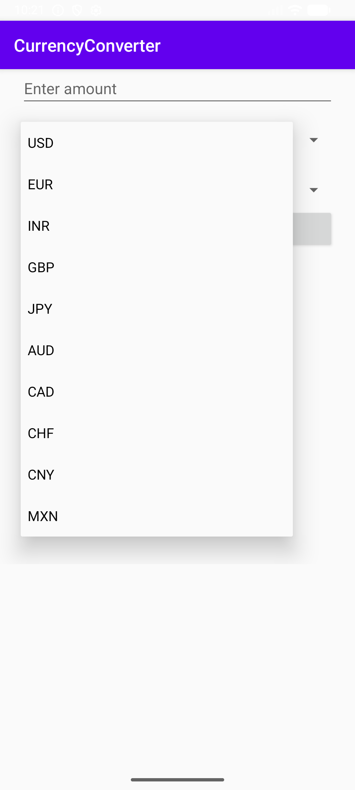
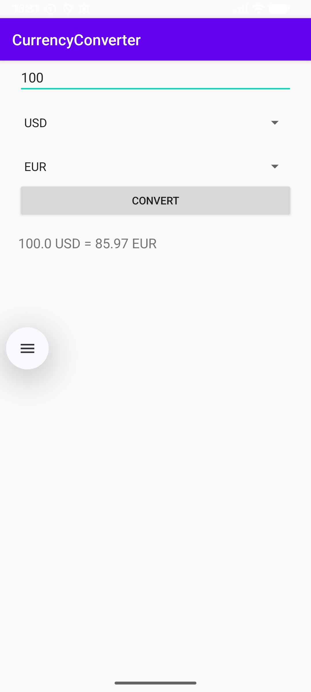
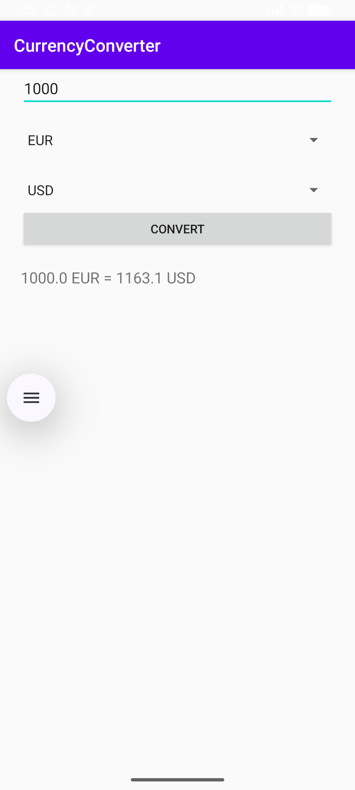

# Currency Converter App

A simple Android application that allows users to convert currencies using real-time exchange rates. This project was created as part of a mobile programming course using Kotlin and Android Studio.

---

## Features

- Convert between multiple currencies
- Real-time exchange rate fetching
- Simple and clean UI
- Add more currencies (future update)

---

## Tech Stack

- Android (Kotlin)
- XML Layout UI
- Activity-based architecture
- HttpURLConnection and JSON parsing
- Coroutines for background tasks
- Optional JUnit testing support

---

## Screenshots

### Main Screen


### Currency Selection Menu


### Conversion Result


### App Running on Emulator


---

## How to Run

1. Clone the repository
   ```bash
   git clone https://github.com/Ernestgfx/CurrencyConverter.git


## License

MIT